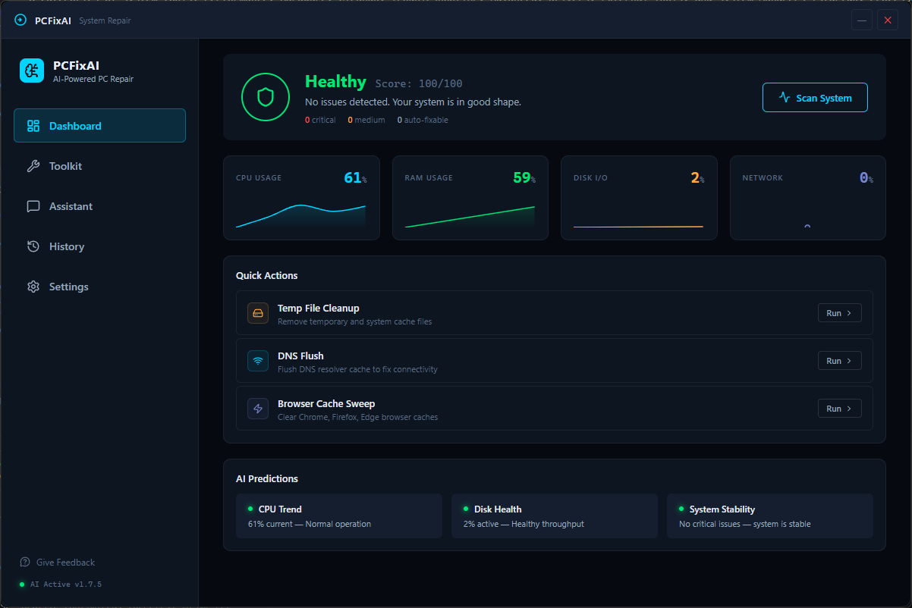
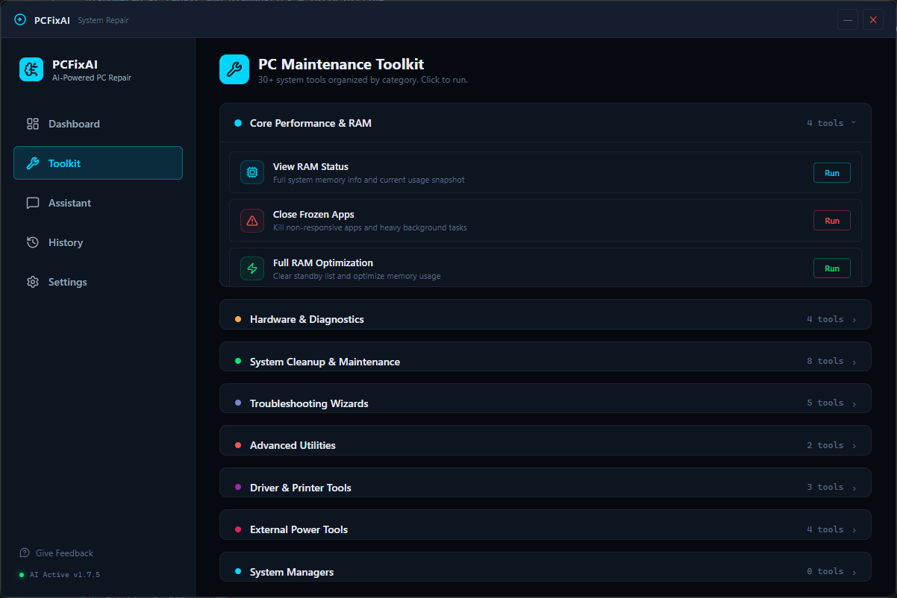
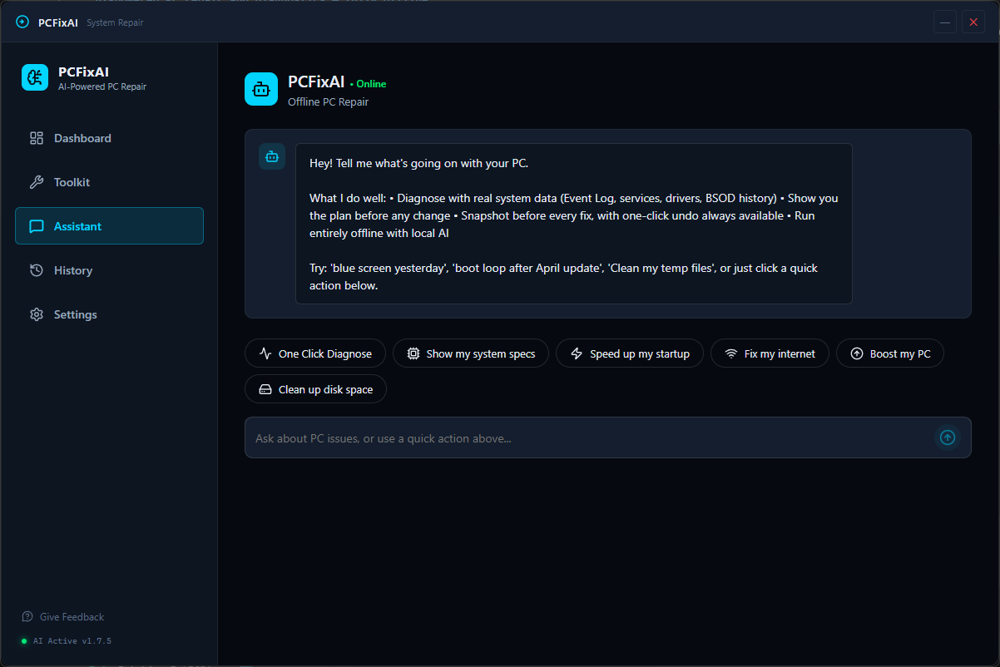

# PCFixAI

**Intelligent PC repair and diagnostics — offline-first.**

PCFixAI is a desktop application that diagnoses and fixes common Windows issues in one click. It scans your system, creates a restore point, and auto-repairs detected problems. Most features work offline; optional AI-powered chat via Ollama.

---

## Latest Update — v1.2.0 (June 2026)

### New Features

- **Ollama AI Integration** — Auto-detects Ollama, in-app install via winget, AI-powered chat for open-ended questions with graceful fallback to rule-based responses
- **Winget App Updater** — Automatically checks for outdated packages via winget, installs winget if missing, updates individual or all apps silently
- **SFC/DISM Manager** — Visual interface for System File Checker and DISM restore health scans with real-time progress, result display, and restart notifications
- **Network Speed Test** — Built-in download/upload/ping speed test using PowerShell (no browser required), with speed ratings (Excellent/Good/Fair/Slow)
- **Driver Backup & Restore** — Export all third-party drivers via DISM, restore from backup via pnputil; browse installed drivers grouped by category

### Improvements

- **Premium UI** — Animated message bubbles, spring-physics accordion, gradient health header, card hover effects, sidebar glow indicators, staggered entrance animations
- **Functional Settings** — Theme dropdown, notifications toggle, log retention, Ollama model config, reset all settings
- **History Logging** — All actions (chat quick actions, dashboard buttons, toolkit operations, scan results) now appear in History
- **Real System Specs** — "Show my system specs" returns live WMI data (CPU, RAM, GPU, Disk, Motherboard, OS)
- **Dashboard Quick Actions** — Temp File Cleanup, DNS Flush, Browser Cache Sweep buttons now execute real commands with status feedback
- **Enhanced Scan** — Rust backend now checks disk space, CPU usage, memory usage, and startup program count
- **Honest External Tools** — Security warnings on internet-dependent tools, clear "Remote Script" badges

---

## Features

- **One-Click System Scan** — Disk health, network connectivity, restore point creation
- **Auto-Fix Agent** — Automatically repairs DNS, cleans temp files, resets network stack, clears browser caches
- **Live System Metrics** — Real-time CPU, RAM, Disk I/O, and Network usage with sparkline charts
- **AI Predictions** — CPU trend analysis, disk health monitoring, system stability scoring
- **Chat Assistant** — Describe your issue or use quick-action buttons to execute real fixes
- **Optional AI** — Install Ollama + llama3.2:3b for AI-powered chat responses (auto-detected, in-app install)
- **Restore Points** — Every scan creates a Windows System Restore point; all changes are reversible
- **Job History** — Full audit trail of every action with exit codes and status
- **Privilege Detection** — Automatically detects admin elevation and warns when deep fixes are restricted
- **Toolkit** — 12 system tools across 12 tabs:
  - Performance, Hardware, Cleanup, Troubleshooting, Advanced, Drivers
  - External Tools (internet-required, with security warnings)
  - Startup Programs, Running Processes, System Services, Installed Apps
  - App Updates (Winget), SFC/DISM, Speed Test, Driver Backup



---

## Internet-Required Features

Most features work offline. These require an internet connection:

| Feature | What it downloads | Why |
|---------|------------------|-----|
| Speed Test | Test files from speedtest.tele2.net | Measures real throughput |
| Winget Install | Winget installer from GitHub | Not bundled with Windows |
| Winget Updates | Package updates from winget sources | Updates come from vendors |
| Auto Update Drivers | PSWindowsUpdate module from PowerShell Gallery | Module not bundled |
| External Power Tools | MAS, WinUtil, WinScript, Winhance scripts | Third-party tools (see warning below) |
| Ollama (optional) | LLM model from Ollama registry | ~2 GB download for llama3.2:3b |

### External Tools Security Notice

The "External Power Tools" category (MAS, WinUtil, WinScript, Winhance) downloads and executes remote scripts with full system access. These are third-party projects not affiliated with PCFixAI. Verify the source before running.

---

## Screenshots

>**Dashboard**

---

>**Toolkit**

---

>**Assistant**


## Tech Stack

| Layer | Technology |
|---|---|
| **Desktop Framework** | [Tauri 2](https://v2.tauri.app/) (Rust backend) |
| **Frontend** | React 18 + TypeScript + Vite |
| **State Management** | Zustand with persist middleware |
| **Charts** | Recharts |
| **Animations** | Framer Motion |
| **Icons** | Lucide React |
| **Backend Language** | Rust (tokio async runtime) |
| **Windows API** | `windows-rs` crate (Win32 Security, Threading, Registry) |
| **Installer** | NSIS |

---

## Installation

### Prerequisites

- **Rust** (via [rustup](https://rustup.rs/))
- **Node.js** (v18+ LTS, via [nodejs.org](https://nodejs.org/))
- **Windows 10/11**

### Setup

```powershell
# Clone the repository
git clone https://github.com/JamesMangao/PCFixAI.git
cd PCFixAI

# Install dependencies
npm install

# Run in dev mode (hot-reload)
npm run tauri:dev
```

### Building for Production

```powershell
# Type-check
npx tsc --noEmit

# Build release
npm run tauri:build

# Output: src-tauri/target/release/bundle/nsis/
```

---

## Usage

1. **Launch** the app — UAC will prompt for admin privileges (recommended for full functionality)
2. **Dashboard** — View system health, live metrics, AI predictions, and run a scan
3. **Assistant** — Chat with the AI or use quick-action buttons:
   - `One Click Diagnose` — Full system scan
   - `Speed up my startup` — Clean temp files, audit startup programs
   - `Fix my internet` — Flush DNS, reset Winsock/TCP/IP
   - `Boost my PC` — Clean caches, activate High Performance power plan
   - `Clean up disk space` — Remove temp files and browser caches
   - `Show my system specs` — Display OS, CPU, RAM, architecture info
4. **Toolkit** — Browse 30+ system tools across 12 tabs; interactive managers for startup programs, running processes, services, installed apps, winget updates, SFC/DISM, speed test, and driver backup
5. **History** — View all past jobs with stats (total ops, success rate, timestamps)
6. **Settings** — Adjust preferences (persisted across restarts)

### Optional: AI-Powered Chat

For AI-powered responses to open-ended questions:

```powershell
# Install Ollama (or use the in-app button)
winget install Ollama.Ollama

# Pull a language model
ollama pull llama3.2:3b
```

PCFixAI auto-detects Ollama and prompts for installation if not found.

---

## Architecture

See [ARCHITECTURE.md](ARCHITECTURE.md) for the full system design, including:

- Tauri vs Electron rationale
- Privilege architecture (UAC elevation flow)
- Event/IPC architecture
- Scan and agent loop decision tree
- Rollback and restore point system
- Ollama AI integration
- Extension points for new fix modules

---

## How It Works

```
User clicks "Scan System" or "One Click Diagnose"
        │
        ▼
Frontend calls invoke("scan_system")
        │
        ▼
Rust backend:
  1. Creates Windows System Restore point
  2. Checks disk health (Get-PhysicalDisk)
  3. Checks network health (Test-NetConnection 8.8.8.8:53)
  4. Checks disk space, CPU usage, memory usage, startup programs
  5. Returns findings to frontend
        │
        ▼
Agent loop auto-fixes each finding:
  - Network issues → ipconfig /flushdns
  - Temp files → Clear-RecycleBin + Remove-Item $env:TEMP\*
  - Browser caches → Chrome/Firefox/Edge/Brave cache sweep
  - OS corruption → DISM /RestoreHealth + sfc /scannow
        │
        ▼
Results streamed to UI via events (scan-status, log-line, job-update, agent-step)
```

---

## Project Structure

```
PCFixAI/
├── src-tauri/          # Rust backend (commands, scan, agent loop)
├── src/                # React frontend (components, store, hooks)
│   ├── components/
│   │   ├── chat/       # ChatInterface with animated messages
│   │   ├── dashboard/  # Dashboard, Settings, History, Findings
│   │   ├── toolkit/    # 12 tool categories + 8 interactive managers
│   │   └── shared/     # Sidebar, TitleBar
│   ├── hooks/          # useLocalAI, useTauriEvents
│   ├── store/          # Zustand state management
│   └── styles/         # globals.css design tokens
├── ARCHITECTURE.md     # Full system design document
├── package.json        # Node dependencies
└── vite.config.ts      # Vite build config
```

---

## Contributing

Contributions are welcome! Here's how:

1. Fork the repository
2. Create a feature branch (`git checkout -b feature/amazing-feature`)
3. Commit your changes (`git commit -m 'Add amazing feature'`)
4. Push to the branch (`git push origin feature/amazing-feature`)
5. Open a Pull Request

### Development Guidelines

- Run `npx tsc --noEmit` before committing to catch type errors
- Run `npm run build` to verify the Vite build succeeds
- Follow existing code style (no comments unless asked, TypeScript strict mode)
- New fix modules should follow the pattern in [ARCHITECTURE.md §7](ARCHITECTURE.md#7-adding-new-fix-modules-extension-points)

---

## License

MIT License. See [LICENSE](LICENSE) for details.

---

## Acknowledgments

- [Tauri](https://tauri.app/) — Secure, lightweight desktop framework
- [Recharts](https://recharts.org/) — Composable charting library
- [Framer Motion](https://www.framer.com/motion/) — Production-ready animations
- [Lucide](https://lucide.dev/) — Beautiful, consistent icons
